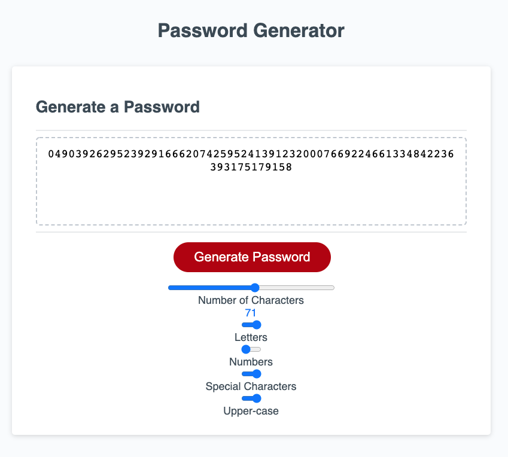

# password-generator

This application was constructed from a supplied html wireframe, bare-bones css style sheet, and incomplete javascript. With some minor modifications to both the supplied html and css code, and the creation of some functions/methods in javascript, the application now functions to create random passwords. Users may select both the length of the generated password, as well as which type of characters the password will be comprised of.

## Motivation and Lessons Learned

This project was quite difficult to complete and I am sure there are much more elegant solutions. I found my comfort grow by the day with basic javascript operations, however with each step forward, I realized a new limitation. For instance, I believe I could have made good use of object notation if my comfort and understanding were just a little better. As it is, I made do with what I felt I could make work. In the end, I think my product works and am happy with the results given the time allotted. Please note the application can get buggy after numerous password generations without refreshing the page.  

### Deployed Application

### Links

Application - https://ihm57511.github.io/password-generator/

Repository - https://github.com/ihm57511/password-generator